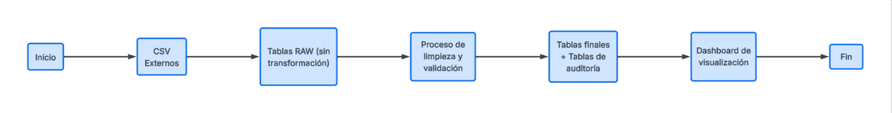
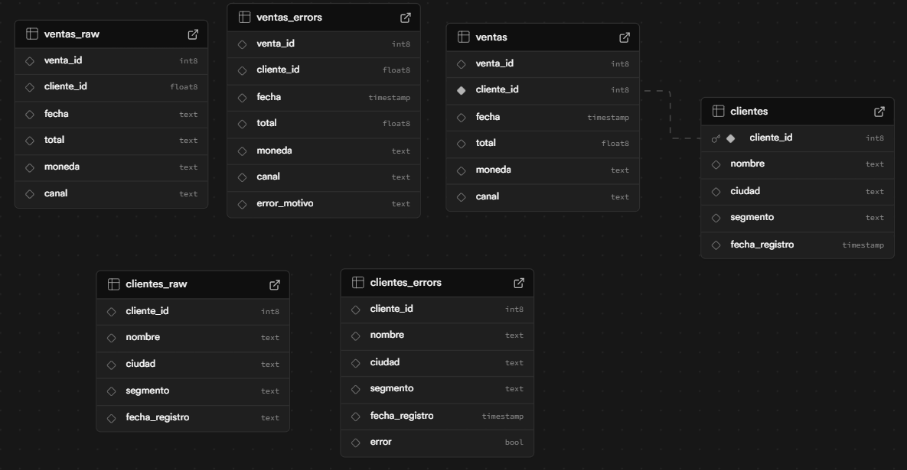

<div align="center">
  <div>
    
    
    
    
    
  </div>

<h1 align="center">📊 Dashboard de Ventas & Auditoría de Datos</h1>
<p align="center">
Prueba Técnica – Carga, Normalización y Explotación de Datos
</p>
</div>

---

## 📋 Table of Contents

1. 🤖 [Introducción](#introduccion)
2. ⚙️ [Tech Stack](#tech-stack)
3. 🔋 [Características](#features)
4. 🧠 [Arquitectura y Flujo](#arquitectura)
5. 🤸 [Quick Start](#quick-start)
6. 🕸️ [Snippets (Code to Copy)](#snippets)
7. 🗄️ [Modelo de Datos](#modelo)
8. 🚀 [Conclusión](#conclusion)

---

## <a name="introduccion">🤖 Introducción</a>

Este proyecto corresponde a una **prueba técnica de desarrollo**, cuyo objetivo es demostrar la capacidad de:

- Cargar datos desde archivos CSV externos
- Limpiar y normalizar información inconsistente
- Preservar errores para auditoría
- Explotar los datos mediante visualización y análisis

La solución simula un **entorno real de datos empresariales**, donde los errores no se eliminan, sino que se **registran, analizan y visualizan**.

---

## <a name="tech-stack">Tech Stack</a>

- **Next.js (App Router)**
- **React**
- **Tailwind CSS**
- **Recharts**
- **PostgreSQL**
- **Supabase**
- **SQL (ETL & auditoría)**

---

## <a name="features">Características</a>

**Carga de datos RAW**  
Los CSV se almacenan sin modificaciones para preservar trazabilidad.

**Normalización de datos**  
- Fechas inválidas
- Valores nulos
- Totales negativos
- Números en formato texto

**Auditoría completa**  
Los errores no se eliminan, se almacenan con su motivo:
- `FECHA_INVALIDA`
- `TOTAL_NEGATIVO`
- `CLIENTE_ID_NULO`
- `FORMATO_INVALIDO`

**Dashboard Analítico**  
- KPIs de errores
- Gráficos por tipo de error
- Gráficos por canal de venta
- Tablas detalladas de auditoría
---

## <a name="arquitectura">Arquitectura y Flujo</a>




```bash
src/
 ├── components/      # Componentes reutilizables
 ├── lib/             # Data Mockup
 ├── public/          # Imágenes
 ├── styles/          # Estilos globales
 ├── App.jsx
 └── main.jsx
```

## <a name="quick-start">🤸 Quick Start</a>

### Prerrequisitos

- [Git](https://git-scm.com/)
- [Node.js](https://nodejs.org/en)
- [npm](https://www.npmjs.com/) (Node Package Manager)

### Clonar repositorio

```bash
git clone https://github.com/AngelEmilioAquino/dashboard-DNI.git
cd dashboard-DNI
```

**Instalar Dependencia**

Instale las dependencias del proyecto usando npm:

```bash
npm install
```

**Correr el proyecto**

```bash
npm run dev
```

Abrir [http://localhost:3000](http://localhost:3000) en el navegador para visualizar el proyecto.

## <a name="snippets">🕸️ Snippets</a>

<details>
<summary><code>Global.css</code></summary>

```jsx
@import 'tailwindcss';
@import 'tw-animate-css';

@custom-variant dark (&:is(.dark *));

:root {
  --background: oklch(1 0 0);
  --foreground: oklch(0.145 0 0);
  --card: oklch(1 0 0);
  --card-foreground: oklch(0.145 0 0);
  --popover: oklch(1 0 0);
  --popover-foreground: oklch(0.145 0 0);
  --primary: oklch(0.205 0 0);
  --primary-foreground: oklch(0.985 0 0);
  --secondary: oklch(0.97 0 0);
  --secondary-foreground: oklch(0.205 0 0);
  --muted: oklch(0.97 0 0);
  --muted-foreground: oklch(0.556 0 0);
  --accent: oklch(0.97 0 0);
  --accent-foreground: oklch(0.205 0 0);
  --destructive: oklch(0.577 0.245 27.325);
  --destructive-foreground: oklch(0.577 0.245 27.325);
  --border: oklch(0.922 0 0);
  --input: oklch(0.922 0 0);
  --ring: oklch(0.708 0 0);
  --chart-1: oklch(0.646 0.222 41.116);
  --chart-2: oklch(0.6 0.118 184.704);
  --chart-3: oklch(0.398 0.07 227.392);
  --chart-4: oklch(0.828 0.189 84.429);
  --chart-5: oklch(0.769 0.188 70.08);
  --radius: 0.625rem;
  --sidebar: oklch(0.985 0 0);
  --sidebar-foreground: oklch(0.145 0 0);
  --sidebar-primary: oklch(0.205 0 0);
  --sidebar-primary-foreground: oklch(0.985 0 0);
  --sidebar-accent: oklch(0.97 0 0);
  --sidebar-accent-foreground: oklch(0.205 0 0);
  --sidebar-border: oklch(0.922 0 0);
  --sidebar-ring: oklch(0.708 0 0);
}

.dark {
  --background: oklch(0.145 0 0);
  --foreground: oklch(0.985 0 0);
  --card: oklch(0.145 0 0);
  --card-foreground: oklch(0.985 0 0);
  --popover: oklch(0.145 0 0);
  --popover-foreground: oklch(0.985 0 0);
  --primary: oklch(0.985 0 0);
  --primary-foreground: oklch(0.205 0 0);
  --secondary: oklch(0.269 0 0);
  --secondary-foreground: oklch(0.985 0 0);
  --muted: oklch(0.269 0 0);
  --muted-foreground: oklch(0.708 0 0);
  --accent: oklch(0.269 0 0);
  --accent-foreground: oklch(0.985 0 0);
  --destructive: oklch(0.396 0.141 25.723);
  --destructive-foreground: oklch(0.637 0.237 25.331);
  --border: oklch(0.269 0 0);
  --input: oklch(0.269 0 0);
  --ring: oklch(0.439 0 0);
  --chart-1: oklch(0.488 0.243 264.376);
  --chart-2: oklch(0.696 0.17 162.48);
  --chart-3: oklch(0.769 0.188 70.08);
  --chart-4: oklch(0.627 0.265 303.9);
  --chart-5: oklch(0.645 0.246 16.439);
  --sidebar: oklch(0.205 0 0);
  --sidebar-foreground: oklch(0.985 0 0);
  --sidebar-primary: oklch(0.488 0.243 264.376);
  --sidebar-primary-foreground: oklch(0.985 0 0);
  --sidebar-accent: oklch(0.269 0 0);
  --sidebar-accent-foreground: oklch(0.985 0 0);
  --sidebar-border: oklch(0.269 0 0);
  --sidebar-ring: oklch(0.439 0 0);
}

@theme inline {
  --font-sans: 'Geist', 'Geist Fallback';
  --font-mono: 'Geist Mono', 'Geist Mono Fallback';
  --color-background: var(--background);
  --color-foreground: var(--foreground);
  --color-card: var(--card);
  --color-card-foreground: var(--card-foreground);
  --color-popover: var(--popover);
  --color-popover-foreground: var(--popover-foreground);
  --color-primary: var(--primary);
  --color-primary-foreground: var(--primary-foreground);
  --color-secondary: var(--secondary);
  --color-secondary-foreground: var(--secondary-foreground);
  --color-muted: var(--muted);
  --color-muted-foreground: var(--muted-foreground);
  --color-accent: var(--accent);
  --color-accent-foreground: var(--accent-foreground);
  --color-destructive: var(--destructive);
  --color-destructive-foreground: var(--destructive-foreground);
  --color-border: var(--border);
  --color-input: var(--input);
  --color-ring: var(--ring);
  --color-chart-1: var(--chart-1);
  --color-chart-2: var(--chart-2);
  --color-chart-3: var(--chart-3);
  --color-chart-4: var(--chart-4);
  --color-chart-5: var(--chart-5);
  --radius-sm: calc(var(--radius) - 4px);
  --radius-md: calc(var(--radius) - 2px);
  --radius-lg: var(--radius);
  --radius-xl: calc(var(--radius) + 4px);
  --color-sidebar: var(--sidebar);
  --color-sidebar-foreground: var(--sidebar-foreground);
  --color-sidebar-primary: var(--sidebar-primary);
  --color-sidebar-primary-foreground: var(--sidebar-primary-foreground);
  --color-sidebar-accent: var(--sidebar-accent);
  --color-sidebar-accent-foreground: var(--sidebar-accent-foreground);
  --color-sidebar-border: var(--sidebar-border);
  --color-sidebar-ring: var(--sidebar-ring);
}

@layer base {
  * {
    @apply border-border outline-ring/50;
  }
  body {
    @apply bg-background text-foreground;
  }
}
```

</details>

<details>
<summary><code>data.ts</code></summary>

```ts
export interface Cliente {
  cliente_id: number
  nombre: string
  ciudad: string
  segmento: string
  fecha_registro: string
}

export interface Venta {
  venta_id: number
  cliente_id: number
  fecha: string
  total: number
  moneda: string
  canal: string
}

export const clientes: Cliente[] = [
  { cliente_id: 1, nombre: "Clínica Guerrero S.A.", ciudad: "La Romana", segmento: "Individual", fecha_registro: "2024-11-23" },
  { cliente_id: 2, nombre: "Raúl Pérez", ciudad: "San Pedro de Macorís", segmento: "Retail", fecha_registro: "2024-12-12" },
  { cliente_id: 3, nombre: "Ferretería Guerrero Corp.", ciudad: "San Pedro de Macorís", segmento: "Individual", fecha_registro: "2024-01-17" },
  { cliente_id: 4, nombre: "Importadora Rodríguez S.A.", ciudad: "Higüey", segmento: "Corporativo", fecha_registro: "2024-10-14" },
  { cliente_id: 5, nombre: "Supermercados Del Este", ciudad: "Santo Domingo", segmento: "Corporativo", fecha_registro: "2024-05-20" },
  { cliente_id: 6, nombre: "María González", ciudad: "Santiago", segmento: "Individual", fecha_registro: "2024-03-08" },
  { cliente_id: 7, nombre: "Tech Solutions RD", ciudad: "Santo Domingo", segmento: "Corporativo", fecha_registro: "2024-07-15" },
  { cliente_id: 8, nombre: "Farmacia Central", ciudad: "La Vega", segmento: "Retail", fecha_registro: "2024-09-22" },
]

export const ventas: Venta[] = [
  { venta_id: 1001, cliente_id: 1, fecha: "2025-03-27", total: 1316.31, moneda: "DOP", canal: "kiosko" },
  { venta_id: 1002, cliente_id: 2, fecha: "2025-01-09", total: 2912.88, moneda: "DOP", canal: "web" },
  { venta_id: 1003, cliente_id: 3, fecha: "2025-02-15", total: 4521.50, moneda: "DOP", canal: "tienda" },
  { venta_id: 1004, cliente_id: 4, fecha: "2025-03-01", total: 8750.00, moneda: "DOP", canal: "web" },
  { venta_id: 1005, cliente_id: 5, fecha: "2025-01-20", total: 15230.75, moneda: "DOP", canal: "tienda" },
  { venta_id: 1006, cliente_id: 6, fecha: "2025-02-28", total: 890.25, moneda: "DOP", canal: "kiosko" },
  { venta_id: 1007, cliente_id: 7, fecha: "2025-03-15", total: 23450.00, moneda: "DOP", canal: "web" },
  { venta_id: 1008, cliente_id: 8, fecha: "2025-03-20", total: 3200.50, moneda: "DOP", canal: "tienda" },
  { venta_id: 1009, cliente_id: 1, fecha: "2025-02-10", total: 2100.00, moneda: "DOP", canal: "web" },
  { venta_id: 1010, cliente_id: 2, fecha: "2025-03-05", total: 1850.75, moneda: "DOP", canal: "kiosko" },
  { venta_id: 1011, cliente_id: 3, fecha: "2025-01-25", total: 5600.00, moneda: "DOP", canal: "tienda" },
  { venta_id: 1012, cliente_id: 4, fecha: "2025-02-20", total: 9200.50, moneda: "DOP", canal: "web" },
]

// Helper functions for dashboard statistics
export function getTotalVentas(): number {
  return ventas.reduce((sum, v) => sum + v.total, 0)
}

export function getTotalClientes(): number {
  return clientes.length
}

export function getVentasPorCanal(): { canal: string; total: number; count: number }[] {
  const canalMap = new Map<string, { total: number; count: number }>()
  
  for (const venta of ventas) {
    const existing = canalMap.get(venta.canal) || { total: 0, count: 0 }
    canalMap.set(venta.canal, {
      total: existing.total + venta.total,
      count: existing.count + 1
    })
  }
  
  return Array.from(canalMap.entries()).map(([canal, data]) => ({
    canal,
    ...data
  }))
}

export function getVentasPorMes(): { mes: string; total: number }[] {
  const meses = ["Ene", "Feb", "Mar", "Abr", "May", "Jun", "Jul", "Ago", "Sep", "Oct", "Nov", "Dic"]
  const mesMap = new Map<number, number>()
  
  for (const venta of ventas) {
    const mesIndex = new Date(venta.fecha).getMonth()
    const existing = mesMap.get(mesIndex) || 0
    mesMap.set(mesIndex, existing + venta.total)
  }
  
  return Array.from(mesMap.entries())
    .sort((a, b) => a[0] - b[0])
    .map(([mesIndex, total]) => ({
      mes: meses[mesIndex],
      total
    }))
}

export function getClientesPorSegmento(): { segmento: string; count: number }[] {
  const segmentoMap = new Map<string, number>()
  
  for (const cliente of clientes) {
    const existing = segmentoMap.get(cliente.segmento) || 0
    segmentoMap.set(cliente.segmento, existing + 1)
  }
  
  return Array.from(segmentoMap.entries()).map(([segmento, count]) => ({
    segmento,
    count
  }))
}

export function getVentasRecientes(): (Venta & { cliente_nombre: string })[] {
  return ventas
    .sort((a, b) => new Date(b.fecha).getTime() - new Date(a.fecha).getTime())
    .slice(0, 5)
    .map(venta => {
      const cliente = clientes.find(c => c.cliente_id === venta.cliente_id)
      return {
        ...venta,
        cliente_nombre: cliente?.nombre || "Cliente Desconocido"
      }
    })
}
```

</details>

# <a name="modelo">🗄️ Modelo de Datos</a>



<details>
<summary><code>Tables</code></summary>

```sql
CREATE TABLE clientes_raw (
  id SERIAL PRIMARY KEY,
  cliente_id TEXT,
  nombre TEXT,
  ciudad TEXT,
  segmento TEXT,
  fecha_registro TEXT
);

CREATE TABLE ventas_raw (
  id SERIAL PRIMARY KEY,
  venta_id TEXT,
  cliente_id TEXT,
  fecha TEXT,
  total TEXT,
  moneda TEXT,
  canal TEXT
);

CREATE TABLE clientes (
    cliente_id INT PRIMARY KEY,
    nombre TEXT NOT NULL,
    ciudad TEXT NOT NULL,
    segmento TEXT NOT NULL,
    fecha_registro DATE NOT NULL
);

CREATE TABLE ventas (
    venta_id INT PRIMARY KEY,
    cliente_id INT NOT NULL,
    fecha DATE NOT NULL,
    total NUMERIC(10,2) NOT NULL CHECK (total >= 0),
    moneda TEXT NOT NULL,
    canal TEXT NOT NULL,

    CONSTRAINT fk_cliente
        FOREIGN KEY (cliente_id)
        REFERENCES clientes(cliente_id)
);

CREATE TABLE clientes_errors (
    cliente_id INT,
    nombre TEXT,
    email TEXT,
    fecha_registro TEXT,
    error_motivo TEXT NOT NULL,
    created_at TIMESTAMP DEFAULT now()
);

CREATE TABLE ventas_errors (
    venta_id INT,
    cliente_id INT,
    fecha TEXT,
    total TEXT,
    moneda TEXT,
    canal TEXT,
    error_motivo TEXT NOT NULL,
    created_at TIMESTAMP DEFAULT now()
);
```
</details>

<details>
<summary><code>Cambios en las tablas que hice</code></summary>

```sql
-- CLIENTES
ALTER TABLE public.clientes
ALTER COLUMN cliente_id SET NOT NULL;

ALTER TABLE public.clientes
ADD CONSTRAINT clientes_pkey PRIMARY KEY (cliente_id);

-- VENTAS
ALTER TABLE public.ventas
ALTER COLUMN cliente_id TYPE bigint USING cliente_id::bigint;

ALTER TABLE public.ventas
ALTER COLUMN cliente_id SET NOT NULL;

-- FOREIGN KEY
ALTER TABLE public.ventas
ADD CONSTRAINT ventas_cliente_fk
FOREIGN KEY (cliente_id)
REFERENCES public.clientes (cliente_id);
```

## <a name="conclusion">🚀 Conclusión</a>

El **Dashboard DNI** representa una solución completa para la carga, limpieza, normalización y explotación de datos provenientes de fuentes externas, cumpliendo con los objetivos establecidos en la prueba técnica. El proyecto integra de manera efectiva procesos de tratamiento de datos con una capa de visualización moderna y funcional.

### Aspectos Técnicos

A nivel técnico, se aplicaron buenas prácticas en el manejo de datos, asegurando la correcta normalización de fechas, validación de valores inconsistentes y conversión de datos numéricos, sin comprometer la integridad de la información original. Esto permite obtener datos confiables y listos para análisis, consultas y visualización.

### Enfoque Frontend

Desde el enfoque frontend, el dashboard fue desarrollado con una arquitectura clara y reutilizable, priorizando la experiencia de usuario mediante visualizaciones intuitivas, componentes desacoplados y un diseño moderno basado en **Glassmorphism**, lo que facilita la lectura de métricas y la interpretación de resultados.

### Conclusiones Finales

Este proyecto demuestra la capacidad de abordar un flujo de datos de extremo a extremo, desde la ingestión hasta la explotación visual, tomando decisiones técnicas justificadas y escalables. El **Dashboard DNI** establece una base sólida para futuras extensiones, como integración de APIs, automatización de procesos ETL o análisis más avanzados, cumpliendo con los criterios de evaluación y reflejando un enfoque profesional en el desarrollo de software.


